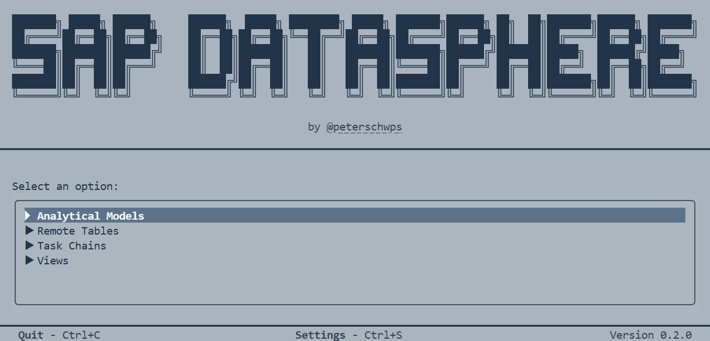
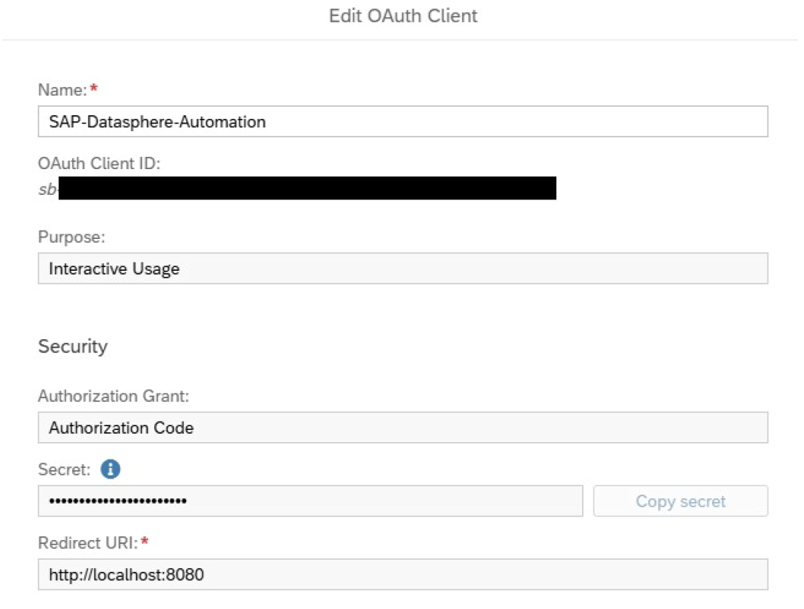

# SAP Datasphere CLI

[](https://pypi.org/project/Datasphere-CLI/)
[](https://pypi.org/project/Datasphere-CLI/)
[](https://github.com/peterschwps/SAP-Datasphere-CLI/actions/workflows/ci.yml)
[](LICENSE.txt)

**Retro-styled CLI for SAP Datasphere** that automates various tasks such as managing
analytical models, remote tables, task chains and views.



## 📋 Table of Contents

- [Overview](#-overview)
- [Features](#-features)
- [Prerequisites](#-prerequisites)
- [Installation](#-installation)
- [Configuration](#-configuration)
- [Usage](#-usage)
- [Detailed Function Overview](#-detailed-function-overview)
- [Development](#-development)
- [Notes](#-notes)
- [Disclaimer](#-disclaimer)

## 🎯 Overview

This program enables the automation of recurring tasks in SAP Datasphere. It
provides scripts for managing:

- Analytical Models
- Remote Tables
- Task Chains
- Views

## ✨ Features

### Analytical Models

- Export all analytical models with their views
- Export all analytical models of a specific space with their views
- Runtime analysis for persisting all views of analytical models

### Remote Tables

- Create statistics (Record Count, Simple Statistics, Histogram)
- Refresh existing statistics

### Task Chains

- Run task chains

### Views

- Export all views with a perfect persistence score of 10 (using view analyzer)
- Export all views that have an attribute that contains a specific substring
- Create partitions by year
- Remove partitions
- Lock partitions up to a specific year
- Unlock partitions
- Persist views
- Unpersist views

## 🔧 Prerequisites

- **Python**: Version 3.12 or newer
- **uv** for package management

## 📦 Installation

### Option A: Windows (Release)

1. Download the latest release asset: `DatasphereAutomation-<version>-windows.exe`.

2. Run via double-click or from a terminal:

    ```bash
    DatasphereAutomation-<version>-windows.exe
    ```

----

### Option B: macOS (PyPI)

1. Install the CLI as a tool with [uv](https://docs.astral.sh/uv/)
   (or use pipx):

    ```bash
    uv tool install datasphere-cli
    ```

2. Run it from the terminal:

    ```bash
    datasphere
    ```

Update to the latest release with `uv tool upgrade datasphere-cli`.

----

### Option C: Install from Git (all platforms)

1. Clone the repository:

    ```bash
    git clone https://github.com/peterschwps/SAP-Datasphere-CLI.git
    cd SAP-Datasphere-CLI
    ```

2. Install with uv (recommended):

    ```bash
    uv sync
    ```

3. Install the required browsers for Playwright:

    ```bash
    uv run playwright install
    ```

    Docs: <https://playwright.dev/docs/intro>.

### For Developers

1. Clone the repository and navigate to the project directory

2. Install dev dependencies:

    ```bash
    uv sync --group dev
    ```

3. Install Playwright:

    ```bash
    uv run playwright install
    ```

## 🔧 Configuration

The configuration is quite similar to the
[official SAP Datasphere CLI](Configuration). In Datasphere you need to create
an [OAuth Client for Interactive Usage](https://help.sap.com/docs/SAP_DATASPHERE/c8a54ee704e94e15926551293243fd1d/3f92b46fe0314e8ba60720e409c219fc.html).
This client will be used to authenticate and execute commands on SAP
Datasphere. The full configuration of the settings file (`settings.ini`) is
described down below.

> [!IMPORTANT]
> Please set the **Redirect URI** to `http://localhost:8080` when creating the
OAuth Client. This is the default port that the CLI listens on to retrieve the
callback code.

**This is how your OAuth Client should look like:**



### Creating settings.ini

In order to create the settings file you need to run the CLI once. This will
create a `settings.ini` in your user configuration directory:

- **macOS/Linux**: `~/.config/Datasphere/settings.ini`
- **Windows**: `%APPDATA%\Datasphere\settings.ini`

### Configuring settings.ini

Open the `settings.ini` file and configure the following settings:

```ini
[Setup]
# Your SAP Datasphere URL
# (System > Administration > Tenant Links: SAP Datasphere URL)
DATASPHERE_URL = https://example.eu10.hcs.cloud.sap

# The Authorization URL for OAuth Clients
# (System > Administration > App Integration: Authorization URL)
AUTHORIZATION_URL = https://example.authentication.eu10.hana.ondemand.com/oauth/authorize

# The Token URL for OAuth CLients
# (System > Administration > App Integration: Token URL)
TOKEN_URL = https://example.authentication.eu10.hana.ondemand.com/oauth/token

# Browser to use for the initial Authentication: 'CHROME' or 'EDGE'
BROWSER_TO_USE = EDGE

[Credentials]
# OAuth Client ID of your Configured Client
# (System > Administration > App Integration: Configured Clients: OAuth Client ID)
CLIENT_ID =

# Secret of your Configured Client
# (System > Administration > App Integration: Configured Clients: Secret)
# NOTE: This value can be left empty and be set with an environment variable 'SECRET'.
SECRET =
```

## 🚀 Usage

### Execution

```bash
uv run python main.py
```

**Executable:**

```bash
.\DatasphereAutomation.exe
```

### First Run / Expired Tokens

On first execution (or if your refresh token has expired), the CLI will open a
browser window. After logging in the site will automatically redirect to
`http://localhost:8080`, fetch the callback code and close the browser window.

This will create a login session which can be refreshed automatically in the
future.

### Menu Navigation

The program starts with an interactive menu:

1. Select a category
2. Choose a function
3. Enter the required parameters
4. Optionally select the number of threads for parallel execution

### Directory Structure

The `datasphere/` folder will be created in the directory where you run the
program. It contains three important subdirectories:

- **`exports/`**: Contains all extracted data created during program execution
                  (JSON, CSV files)
- **`results/`**: Contains an overview of executed tasks showing their status
                  (successful / unsuccessful)
- **`tasks/`**: Contains all task files (CSV format) that specify what should
                be processed

> [!WARNING]
> All files in `exports/` and `results/` are **reset on program start**! If you
> want to preserve files, rename or move them to a different location.

### Threading

For time-intensive tasks, threads can be used to process multiple tasks in
"parallel" using asynchronous requests. This can significantly improve
performance but should be used with caution to avoid triggering rate limits.
A thread count of 5-10 has proven to work well.

### Stopping the Program

You can stop program execution at any time by pressing `Ctrl + C`.

## 📖 Detailed Function Overview

### 1. Analytical Models

<details>
<summary>
    <strong>
        1.1 Export All Analytical Models with their Views
    </strong>
</summary>

Creates an overview of **ALL** analytical models with their views in JSON format.

**Required task file:** None

**Parameters:**

- **Skip duplicates** (yes/no): If enabled, views that already occur in
                                multiple analytical models are only saved once
                                and not for every model.

**Output file:** `exports/analytical_models_with_all_views.json`

**Example output:**

```json
{
    "6BB18AB407AC02FH23804E421859F129": {
        "name": "Sales Analytical Model",
        "dependencies": {
            "606E8AB407FG02FB18004E438092F770": [
                "SALES_DEPARTMENT",
                "Sales2025"
            ],
            "606E8AB407FG02FB58929E438092F771": [
                "MASTER_DATA",
                "Customers"
            ]
        }
    }
}
```

</details>

<details>
<summary>
    <strong>
        1.2 Export All Analytical Models of a Specific Space with their Views
    </strong>
</summary>

Performs the same logic as 1.1, but only processes analytical models from a
specific space.

**Required task file:** None

**Parameters:**

- **Space name**: The technical name of the space (e.g., `CENTRAL_IT`)
- **Skip duplicates** (yes/no): If enabled, views that already occur in
                                multiple analytical models are only saved once
                                and not for every model.

**Output file:** `exports/analytical_models_with_all_views_in_<space_name>.json`

**Example output:**

```json
{
    "6BB18AB407AC02FH23804E421859F129": {
        "name": "Sales Analytical Model",
        "dependencies": {
            "606E8AB407FG02FB18004E438092F770": [
                "SALES_DEPARTMENT",
                "Sales2025"
            ],
            "606E8AB407FG02FB58929E438092F771": [
                "MASTER_DATA",
                "Customers"
            ]
        }
    }
}
```

</details>

<details>
<summary>
    <strong>
        1.3 Runtime Analysis for Persisting All Views of Analytical Models
    </strong>
</summary>

Checks the persistence time for all views of the analytical models listed in
the task file.

**Required task file:** `tasks/analytical_models_to_check_view_persistence_time.csv`

**Parameters:** None

**Output file:** `exports/analytical_models_with_all_views_and_persistence_time.json`

**Example output:**

```json
{
    "6BB18AB407AC02FH23804E421859F129": {
        "name": "Sales Analytical Model",
        "dependencies": {
            "606E8AB407FG02FB18004E438092F770": {
                "space": "SALES_DEPARTMENT",
                "name": "Sales2025",
                "runtime": 78,
                "alreadyPersisted": true,
                "removedPersistency": false
            },
            "606E8AB407FG02FB58929E438092F771": {
                "space": "MASTER_DATA",
                "name": "Customers",
                "runtime": 123,
                "alreadyPersisted": false,
                "removedPersistency": true
            }
        }
    }
}
```

**Note:** A `runtime` value of `null` indicates an error occurred (or the
          program is still running if the file is opened during execution).

</details>

### 2. Remote Tables

<details>
<summary>
    <strong>
        2.1 Create Statistics (Record Count, Simple Statistics or Histogram)
    </strong>
</summary>

Creates statistics for all remote tables that do not have a statistic or those
that have a statistic of a different type. Existing tables with the same
statistics type are skipped.<br>

**Please note:**: For remote tables that already have the same statistics type,
                  you should use the refresh statistics script (2.2).

**Required task file:** None

**Parameters:**

- **Statistics type**:
  1. Record Count
  2. Simple Statistics
  3. Histogram

**Output file:** None

**Example output:** None

**Reference:** [SAP Datasphere Documentation - Statistics for Remote Tables](https://help.sap.com/docs/SAP_DATASPHERE)

</details>

<details>
<summary><strong>2.2 Refresh Existing Statistics</strong></summary>

Updates all existing statistics for remote tables.

**Required task file:** None

**Parameters:** None

**Output file:** None

**Example output:** None

</details>

### 3. Task Chains

<details>
<summary><strong>3.1 Run Task Chains</strong></summary>

Runs all task chains in the task file and exports the results of the runs.

**Required task file:** `tasks/task_chains_to_run.csv`

**Parameters:** None

**Output file:** `tasks/task_chains_completed.csv`

**Example output:**

```csv
entity,space,isCompleted,runtime
AnalyzeSales2025,SALES_DEPARTMENT,true,1025
```

</details>

### 4. Views

<details>
<summary>
    <strong>
        4.1 Export All Views with a Perfect Persistence Score of 10
            (Using View Analyzer)
    </strong>
</summary>

Performs view analysis on all views and saves all views with a perfect
persistence score of 10.

**Required task file:** None

**Parameters:** None

**Output file:** `exports/best_views_to_persist.csv`

**Example output:**

```csv
entity,space,businessName,isPersisted
Sales2025,SALES_DEPARTMENT,Sales (2025),True
```

</details>

<details>
<summary>
    <strong>
        4.2 Export All Views That Have an Attribute That Contains a Specific
            Substring
    </strong>
</summary>

Finds all views that have an attribute containing a specific substring.

**Required task file:** None

**Parameters:**

- **Search word**: The substring to search for (e.g., `YEAR`)

**Output file:** `exports/view_attributes.csv`

**Example output (searching for "YEAR"):**

```csv
entity,space,businessName,attribute
Sales2025,SALES_DEPARTMENT,Sales (2025),FISCAL_YEAR
Customers,SALES_DEPARTMENT,All Customers,YEAR
```

</details>

<details>
<summary><strong>4.3 Create Partitions by Year</strong></summary>

Creates partitions for views based on a yearly interval. Only columns with full
year numbers can be used (in Datasphere: `STRING(4)`).

**Required task file:** `tasks/views_to_create_partitions.csv`

**Parameters:**

- **Lower bound** (>=): Start year for first partition (e.g., `2000`)
- **Upper bound** (<): End year for last partition (e.g., `2040`)
- **Overwrite existing partitions** (yes/no): Whether to overwrite if
                                              partitions already exists

**Example:** For input `2000` to `2040`:

- Partition 1: `>= 2000 AND < 2001`
- Partition 2: `>= 2001 AND < 2002`
- ...
- Partition 40: `>= 2039 AND < 2040`

**Output file:** `results/views_partitions_created.csv`

**Example output:**

```csv
entity,space,attribute,createdPartition
Sales2025,SALES_DEPARTMENT,FISCAL_YEAR,True
Customers,SALES_DEPARTMENT,YEAR,True
```

</details>

<details>
<summary><strong>4.4 Remove Partitions</strong></summary>

Removes all existing partitions from specified views.

**Required task file:** `tasks/views_to_delete_partitions.csv`

**Parameters:** None

**Output file:** `results/views_partitions_deleted.csv`

**Example output:**

```csv
entity,space,removedPartition
Sales2025,SALES_DEPARTMENT,True
```

</details>

<details>
<summary><strong>4.5 Lock Partitions Up to a Specific Year</strong></summary>

Locks partitions up to and including a specific year (<= year entered).
Requires that the views already have partitions. Only partitions with yearly
values can be locked (in Datasphere `STRING(4)`).

**Required task file:** `tasks/views_to_lock_partitions.csv`

**Parameters:**

- **Year**: The year up to which partitions should be locked
            (the entered year is also locked)

**Output file:** `results/views_partitions_locked.csv`

**Example output:**

```csv
entity,space,lockedPartitions
Sales2025,SALES_DEPARTMENT,True
```

</details>

<details>
<summary><strong>4.6 Unlock Partitions</strong></summary>

Unlocks all existing partitions for specified views.

**Required task file:** `tasks/views_to_unlock_partitions.csv`

**Parameters:** None

**Output file:** `results/views_partitions_unlocked.csv`

**Example output:**

```csv
entity,space,unlockedPartitions
Sales2025,SALES_DEPARTMENT,True
```

</details>

<details>
<summary><strong>4.7 Persist Views</strong></summary>

Persists all views listed in the task file.

**Required task file:** `tasks/views_to_persist.csv`

**Parameters:**

- **Save runtime** (yes/no): Whether to record and save the persistence runtime

**Output file:** `results/views_persisted.csv`

**Example output:**

```csv
entity,space,isPersisted,runtime
Sales2025,SALES_DEPARTMENT,True,37
Customers,SALES_DEPARTMENT,True,9
```

</details>

<details>
<summary><strong>4.8 Unpersist Views</strong></summary>

Removes persistence from all views listed in the task file.

**Required task file:** `tasks/views_to_unpersist.csv`

**Parameters:** None

**Output file:** `results/views_unpersisted.csv`

**Example output:**

```csv
entity,space,isRemoved
Sales2025,SALES_DEPARTMENT,True
```

</details>

## 👨‍💻 Development

### Code Quality

The project uses:

- **ruff** for linting and code formatting
- **pyright** for type checking (in basic mode)

### Setting up Development Environment

1. Clone the repository

2. Install development environment:

    ```bash
    uv sync --group dev
    ```

3. Run pre-commit checks:

    ```bash
    uv run ruff check .
    uv run pyright .
    ```

### Logging

The program uses logging. Log files are created for each day and saved in the
user data directory:

- **macOS/Linux**: `~/.local/share/Datasphere/`
- **Windows**: `%LOCALAPPDATA%\Datasphere\`

## 📃 Notes

- **Cookies**: Authentication cookies are saved in
               `~/.config/Datasphere/.cookies.json` and automatically reused.
- **Session Duration**: The SAP Datasphere session expires after 1 hour and is
                        automatically renewed using the persistent
                        authentication cookies which last for 3 months.
- **Threading**: "Parallel" execution is implemented using asynchronous
                 requests. Running tasks simoultaneously can improve
                 performance but should be used with caution to avoid
                 triggering rate limits.
- **Export/Results**: All files in `exports/` and `results/` are overwritten on
                      the next program start. You can either move or rename
                      them to prevent results being overwritten.
- **Browser**: When using browser authentication, a new browser profile is
               being created to speed up future logins.

## 🚨 Disclaimer

**Important Note**: This tool is designed for use with SAP Datasphere. Please
                    ensure you have the necessary permissions before executing
                    automation tasks.

**Disclaimer:** It is in no way affiliated with, authorized, maintained, or
                endorsed by SAP or any of its affiliates or subsidiaries. It is
                an independent and unofficial project. Use it at your own risk.
